# AWS 3-Tier Enterprise Web Application Deployment

A secure, highly available, and auto-scaling production-ready 3-tier architecture deployed on AWS. This architecture decouples the web presentation tier, the logic processing application tier, and the relational database management systems to achieve maximal security, high availability, fault tolerance, and fluid horizontal scaling.

---

## Architecture Overview

The application is architected within an isolated Custom Virtual Private Cloud (VPC) spanning across two unique Availability Zones (AZs) for comprehensive disaster recovery and redundancy.

Reference image below:

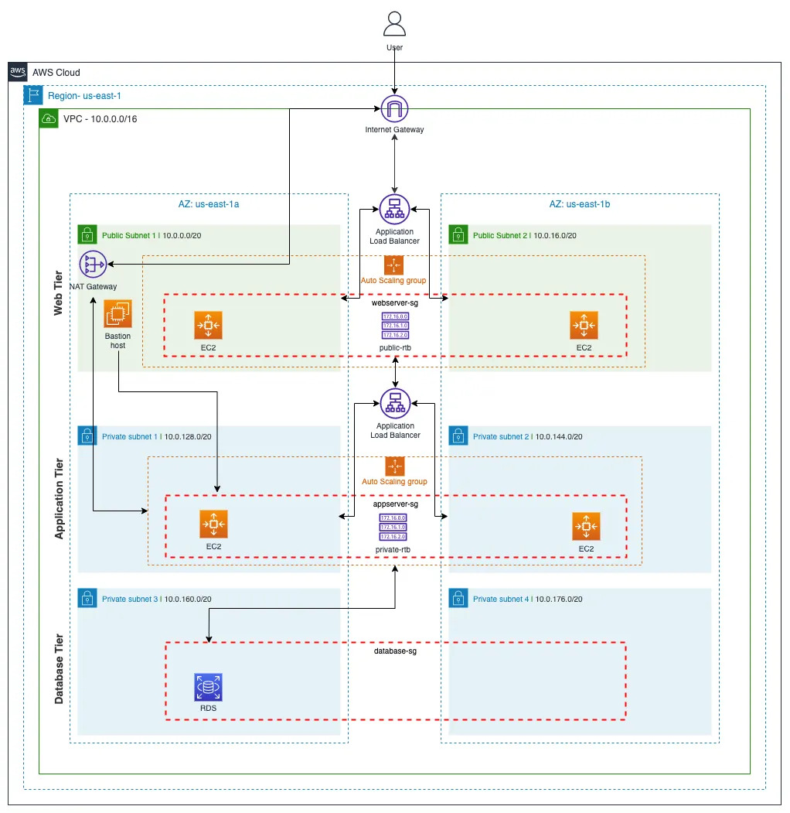


### Key Highlights
* **Web Presentation Tier:** Public-facing Nginx load-balanced proxy servers operating within public subnets configured to force structural HTTPS policies.
* **Application Processing Tier:** Isolated private application instances hosting a custom Node.js application running on Port 4000 via PM2 process management.
* **Data Persistent Tier:** Multi-AZ structured RDS MySQL instances configured within private database subnets strictly accessible exclusively from the application network layer.

## 🛠️ Network & Security Blueprint

### 1. Custom Core VPC Specification

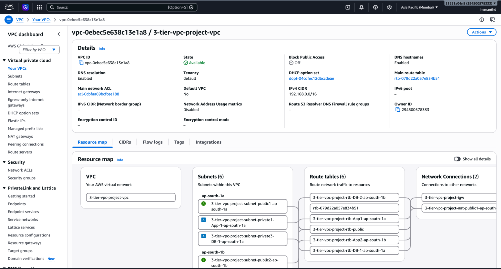
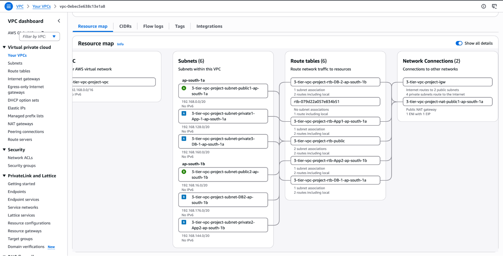

* **VPC Block Provisioning:** `VPC and more` enabled.
* **Resource Tagging (Auto-Generate Base):** `3-tier-vpc-project`
* **IPv4 CIDR Block Assignment:** `192.168.0.0/16`
* **Availability Zones Distributed:** 2 Active AZs (`ap-south-1a` / `ap-south-1b`)
* **Subnet Allocations:** 6 total (2 Public Web Subnets, 2 Private App Subnets, 2 Private DB Subnets)
* **NAT Gateway Architecture:** 1 Dynamic NAT Gateway deployed into a Public Subnet for internet outbound tracking from private application tiers.
* **VPC Endpoints Configured:** None

### 2. Security Group Firewall Declarations

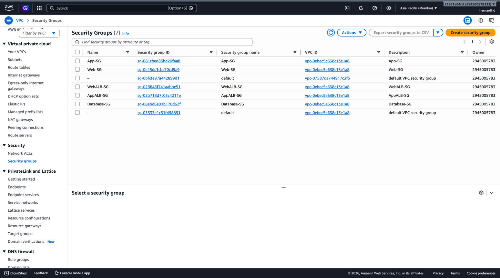

| Security Group ID | Inbound Rule Configuration | Traffic Source Specification | Purpose |
| :--- | :--- | :--- | :--- |
| **WebALB-SG** | HTTP (80) & HTTPS (443) | `0.0.0.0/0` (Anywhere) | Public Entry Point |
| **WebServer-SG** | HTTP (80) & HTTPS (443) | Custom ➔ `WebALB-SG` or `192.168.0.0/16` | Web Proxy Protection |
| **AppInternalALB-SG**| HTTP (80) & HTTPS (443) | Custom ➔ `WebServer-SG` or `192.168.0.0/16`| Private Internal Route |
| **AppServer-SG** | Custom TCP (`4000`) | Custom ➔ `AppInternalALB-SG` or `192.168.0.0/16`| Node.js App Isolation |
| **Database-SG** | MySQL/Aurora (`3306`) | Custom ➔ `AppServer-SG` or `192.168.0.0/16`| Secure Persistent Layer|

---

## 🚀 Execution & Deployment Procedures

### Phase 1: Storage Infrastructure & Local Configuration

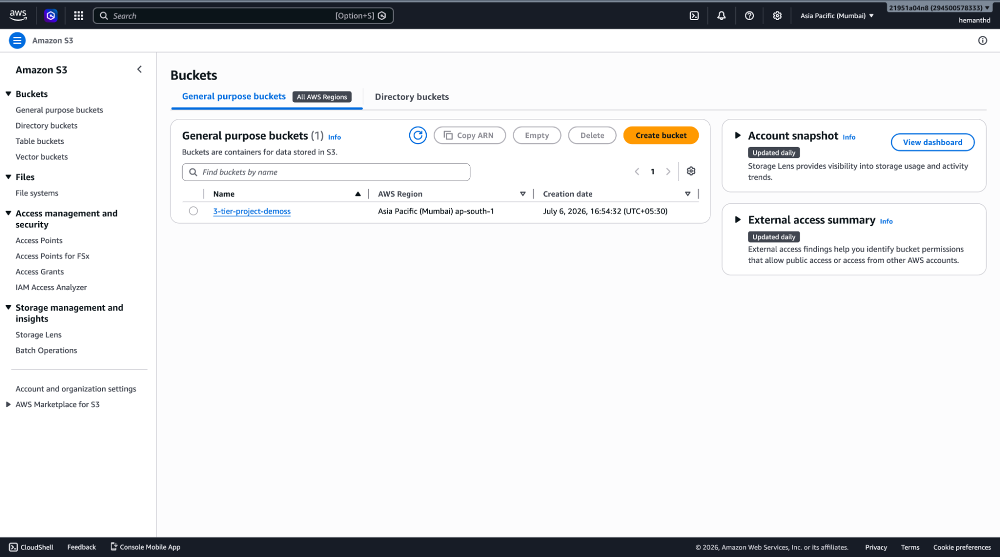
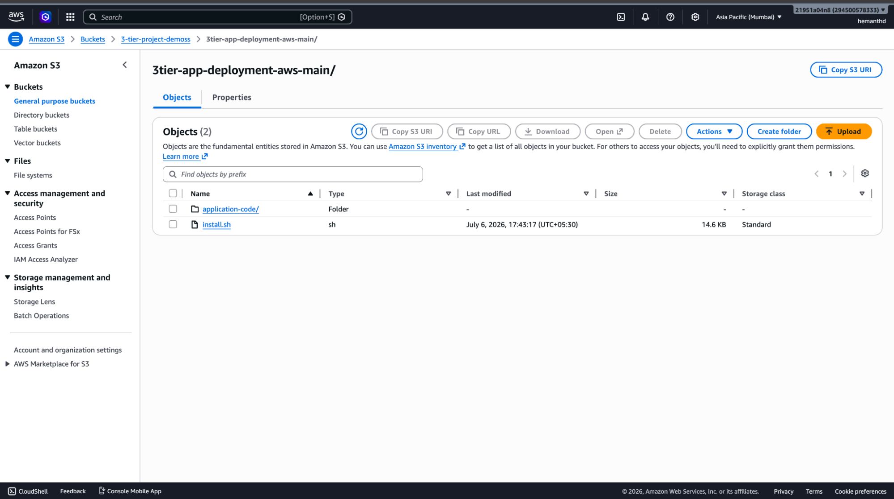

1. Initialize a Private AWS S3 Bucket named `3-tier-project-demoss`.
2. Access your runtime app configuration files and dynamically populate properties matching the target environment:
   * **App-Tier Application Property Adjustments (`DbConfig.js`):** Modify active connection configurations to accept the dynamic AWS RDS instance connectivity endpoint, root username, and security access key passwords.
   * **Web-Tier Proxy Configurations (`nginx.conf`):** Bind targeted internal reverse-proxy mapping variables directly to your functional AWS Internal Application Load Balancer address string:
     ```nginx
     location /api/ {
         proxy_pass http://<YOUR_INTERNAL_ALB_DNS_NAME>:80/;
     }
     ```
3. Upload target runtime scripts alongside standard application package configurations into your S3 bucket root destination partition including your system initialization script (`install.sh`).

### Phase 2: Host Role Provisioning

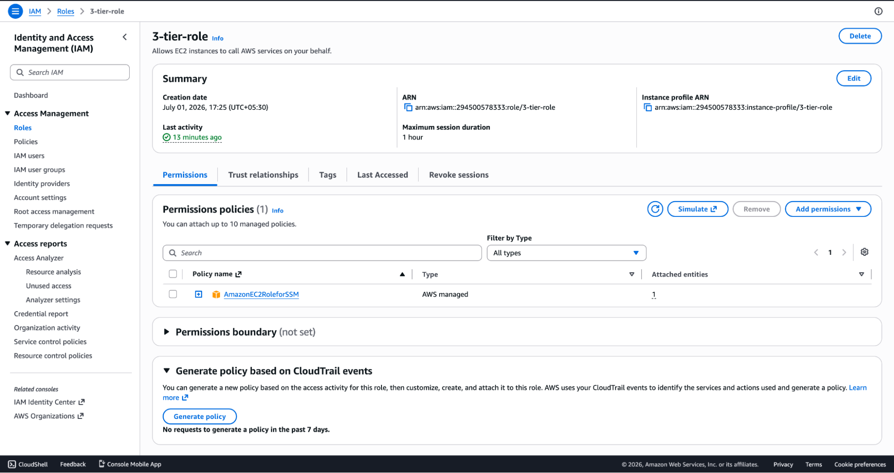

1. Navigate to the **IAM Console** and initialize a structural Service execution Role.
2. Select **EC2** as the trusted use-case entity.
3. Attach standard policy permissions: `AmazonEC2RoleforSSM`.
4. Label and initialize the profile wrapper configuration as `3-tier-role`.

### Phase 3: Relational Database Initialization

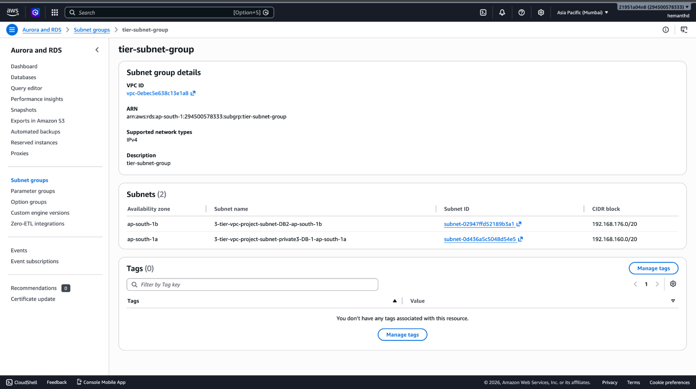
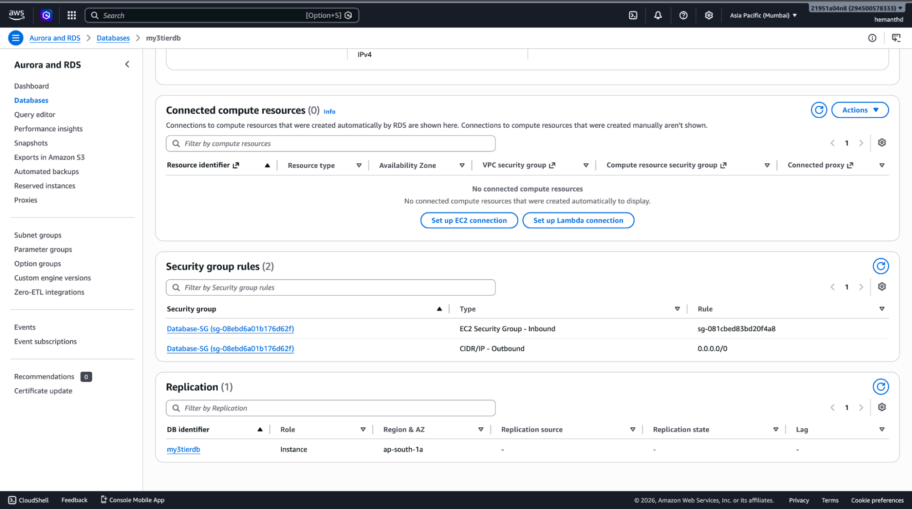
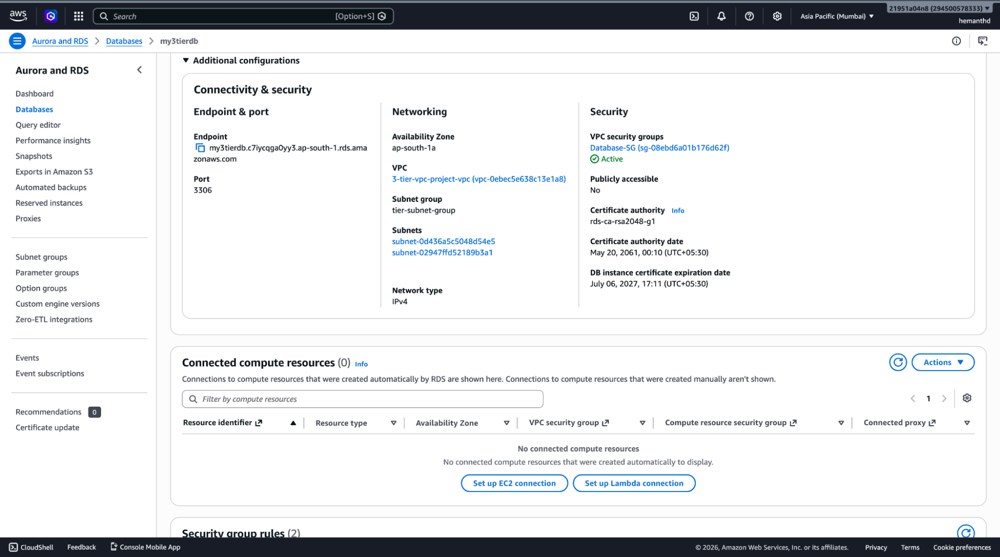
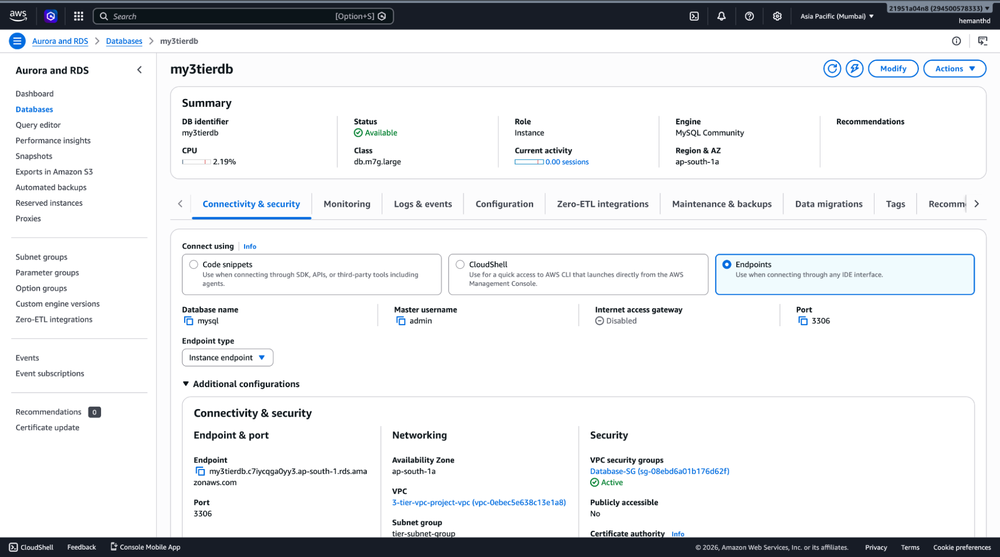

1. Open the **Amazon RDS Dashboard** ➔ Navigate to **Subnet Groups** ➔ Select **Create DB Subnet Group**.
2. Assign identifier tag: `tier-Subnet-Group` within targets associated with network map identifier `3-tier-project-vpc`.
3. Pick your 2 working Availability Zones and provision mappings explicitly targeting subnets defined as `DB1` and `DB2`.
4. Initialize a production-ready **RDS MySQL Database Engine Instance** utilizing parameters defined directly below:
    ```ini
    Engine = MySQL Community Edition
    DB Instance Identifier = my3tierdb
    Master Username = admin
    Master Password = Root123456
    VPC Destination = 3-tier-vpc-project
    DB Subnet Group Assigned = tier-Subnet-Group
    Public Access Visibility = NO (Isolated Private Routing Only)
    Firewall Rule Map = Database-SG
    Automated Backup Matrix = Disabled (Testing Sandbox Flag Only)
    Extract the active runtime Database System Target String:
    my3tierdb.c7iycqga0yy3.ap-south-1.rds.amazonaws.com
    ```
5. Update local structural assets inside (`DbConfig.js`) using your active production target string, then push modified builds back onto S3 distribution storage blocks.

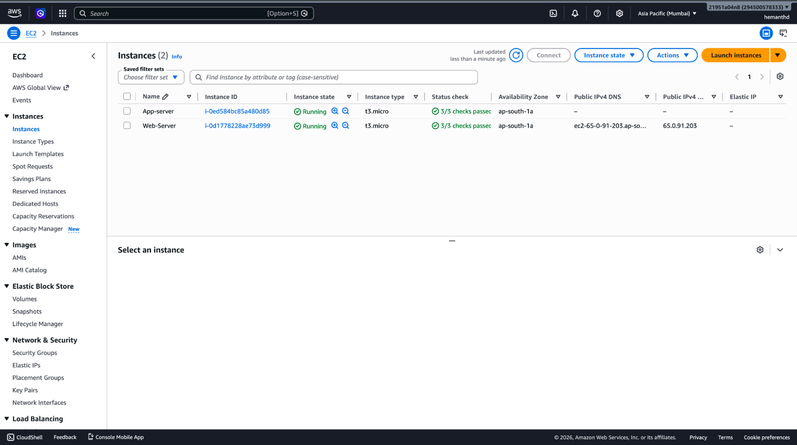

### Phase 4: Application Processing Tier Assembly

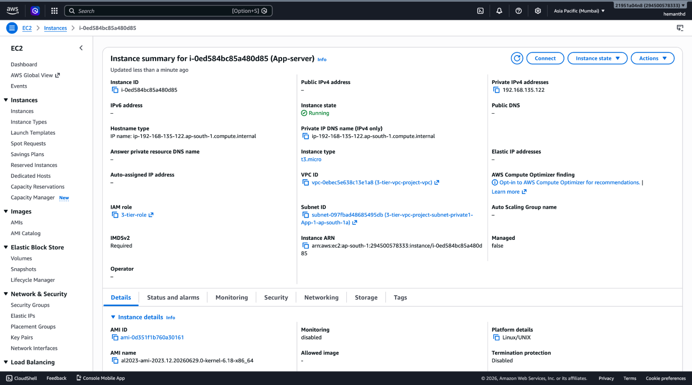

1. Instantiate an EC2 runtime unit using standard default Amazon Linux 2 system templates named `App-Server`.
2. Configure settings under custom VPC identifiers `3-tier-vpc-project`, inside target private structural zone APP1, disabling standard dynamic Public IP assignments.
3. Assign security properties to mirror standard firewall layer parameters (`App-SG`) and hook execution role profiles directly to tracking wrapper definition tags (`3-tier-role`).
4. Connect cleanly directly inside the targeted shell wrapper console structure utilizing safe administrative pipelines under AWS Systems Manager Session Manager terminal proxies.
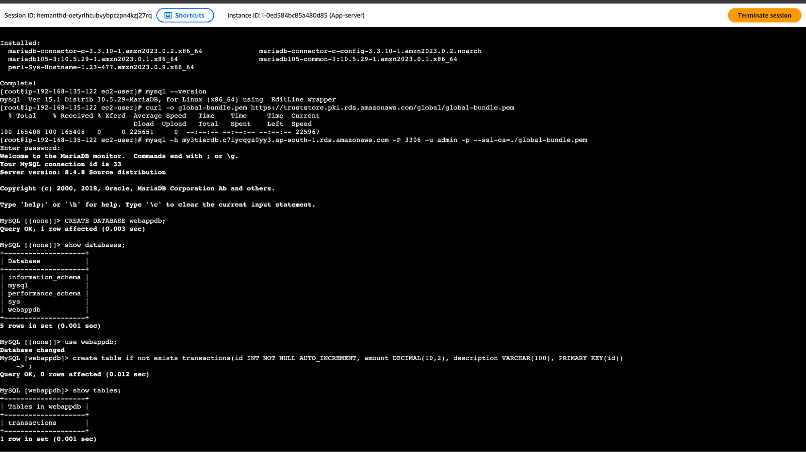
    ```
    # Elevate shell security access configurations
    sudo -s
    cd /home/ec2-user

    # Initialize and establish basic localized application client connectivity tools
    sudo yum install mysql -y

    # Connect to RDS database using mysql client
    mysql -h my3tierdb.c7iycqga0yy3.ap-south-1.rds.amazonaws.com -u admin -p Root123456

    # Initialize enterprise persistent schemas inside production database nodes
    CREATE DATABASE webapp;
    USE webapp;

    CREATE TABLE IF NOT EXISTS transactions(
        id INT NOT NULL AUTO_INCREMENT,
        amount DECIMAL(10, 2),
        description VARCHAR(100),
        PRIMARY KEY(id)
    );

    INSERT INTO transactions (amount, description) VALUES ('400', 'awsbill');
    SELECT * FROM transactions;
    exit

    # Pull runtime environment engines using clean distribution channels
    curl -o- [https://raw.githubusercontent.com/nvm-sh/nvm/v0.40.5/install.sh](https://raw.githubusercontent.com/nvm-sh/nvm/v0.40.5/install.sh) | bash
    source ~/.bashrc

    # Select target deployment baseline specifications
    nvm install 24
    nvm use 24

    # Globally configure PM2 process execution structures
    npm install -g pm2

    # Fetch active application runtime files directly out of target secure S3 Storage locations
    aws s3 cp s3://3-tier-project-demoss/application-code/app-tier/ app-tier --recursive
    cd app-tier

    # Execute deep build dependency initializations
    npm install
    pm2 start index.js

    # Ensure service resilience persistence across standard system reboots
    pm2 startup

    # Validate endpoint response profiles directly across local host network paths
    curl http://localhost:4000/health
    ```

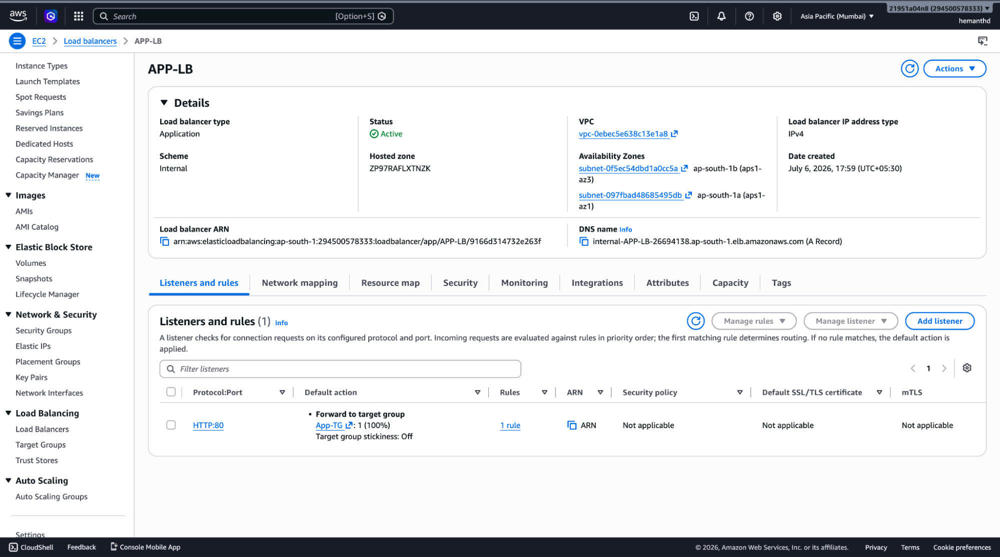
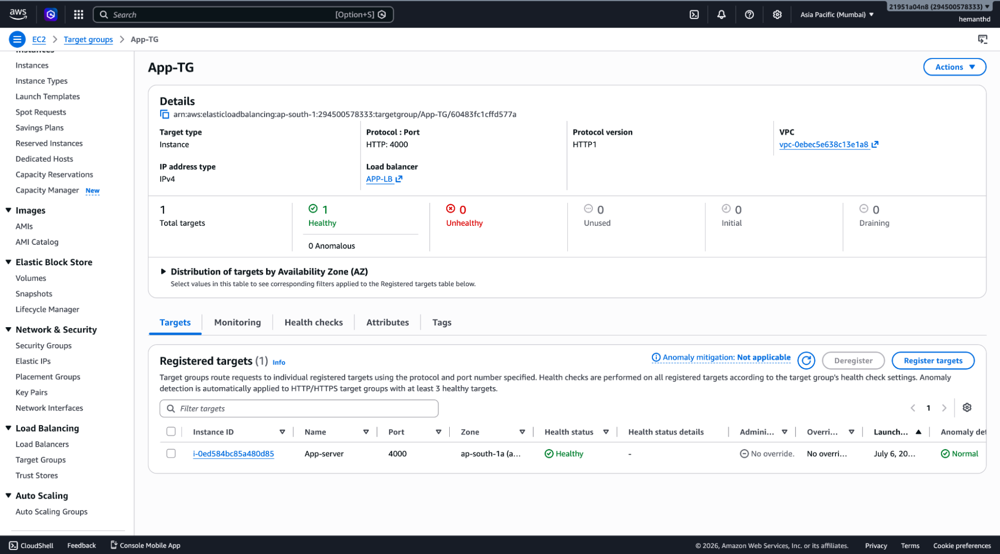

5. Initialize an Internal Application Load Balancer (`app-internal-alb`) targeted to instance targets mapping incoming routes over Port 4000 into the Target Group (`App-TG`), configuring system health tracks to explicitly parse application paths at route endpoint destination location `/health`.

### Phase 5: Web Server Tier Assembly

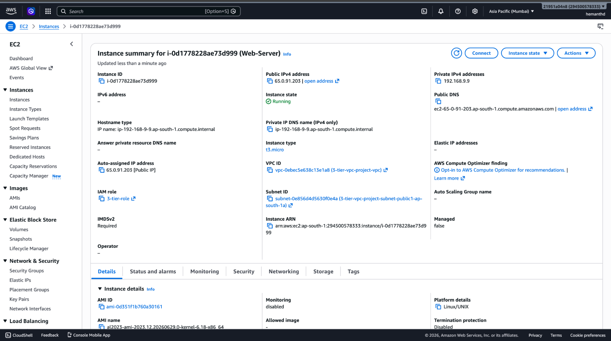

1. Instantiate an external EC2 infrastructure element hosting base configuration profiles matching default Amazon Linux 2 named `Web-Server`. Place this host directly into your active network public map zone (`Public1`) while turning on runtime automatic public IP assignment switches.
2. Bind target security groups to tracking identifier blocks `Web-SG` and specify base execution instance profiles to link to execution tags `3-tier-role`.
3. Open secure administrative session pipelines using AWS Systems Manager tracking frameworks to trigger direct deployment installation scripting operations:
    ```
    # Elevate runtime configuration execution access configurations
    sudo -s
    cd /home/ec2-user

    # Pull custom system initializers directly out of baseline repository trees
    curl -o- [https://raw.githubusercontent.com/nvm-sh/nvm/v0.40.5/install.sh](https://raw.githubusercontent.com/nvm-sh/nvm/v0.40.5/install.sh) | bash
    source ~/.bashrc
    nvm install 24 && nvm use 24

    # Synchronize client configuration assets down out of storage bucket distributions
    aws s3 cp s3://3-tier-project-demo/application-code/web-tier/ web-tier --recursive
    cd ~/web-tier
    npm install
    npm run build

    # Install configuration assets managing production web-traffic routing engines
    sudo yum install nginx -y
    cd /etc/nginx
    sudo rm nginx.conf
    sudo aws s3 cp s3://3-tier-project-demo/application-code/nginx.conf .

    # Start configuration management service modules and calibrate access rules
    sudo systemctl enable nginx
    sudo systemctl start nginx
    ```
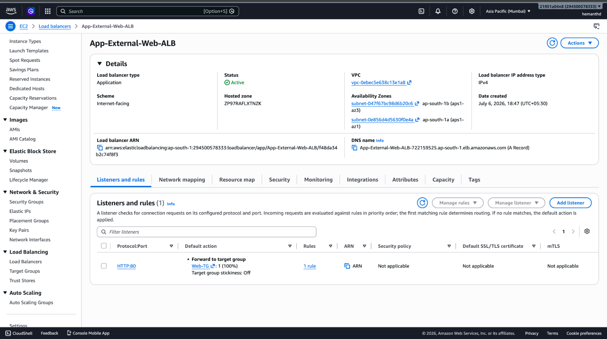
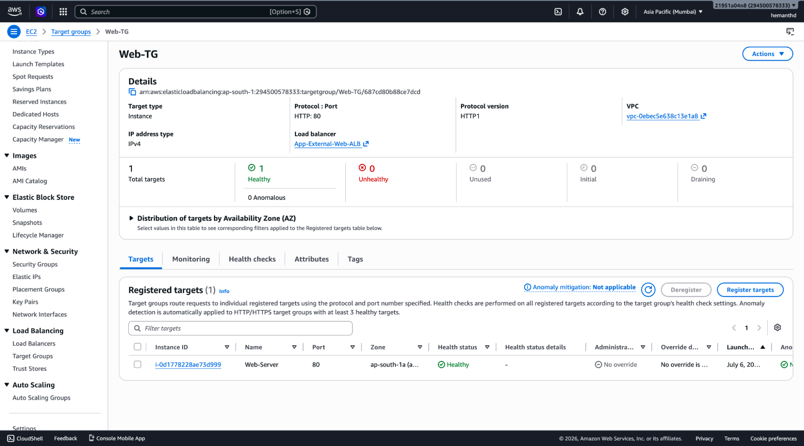
4. Map standard incoming traffic components directly behind a dedicated public Internet-facing Load Balancer configuration set (`app-external-alb`), tracking connectivity layers to accept routes incoming over Port 80, pointing tracking behaviors directly into localized host mappings configured on `Web-TG`.
5. Secure incoming system browser configurations by routing operations cleanly through encryption pipelines running over standard HTTPS profiles via the AWS Certificate Manager (ACM), routing secure traffic directly onto web servers behind safe secure listener settings.

## Auto-Scaling Architecture Setup

To ensure total structural redundancy across scaling production request windows, convert standard application computing components to scale fluidly using custom target AWS Launch Template configurations:

### 1. Application-Tier Scaling Fleet Profile Configurations
- Launch Template Tag Name: `App-LT` (Based on custom configured machine images built from `App-Server-AMI`)
- Infrastructure Type: `t2.micro` running inside firewall configurations managed directly through `App-SG`.
- Auto-Scaling Core Wrapper Name: `App-ASG` bound straight into isolated internal network block partitions `APP1` and `APP2`.
- Dynamic Fleet Size Rules: Desired Capacity: `4`, Minimum Threshold: `2`, Maximum Cap Limits: `6`.
- Automated Scaling Operational Triggers: Execute scale-out behaviors based on tracking rules measuring metric trends where Average CPU Utilization crosses above a threshold limit of `70%`.

### 2. Web Presentation-Tier Scaling Fleet Profile Configurations
- Launch Template Tag Name: `Web-LT` (Based on custom configured machine images built from `Web-Server-AMI`)
- Infrastructure Type: `t2.micro` running inside firewall configurations managed directly through `Web-SG`.
- Auto-Scaling Core Wrapper Name: `Web-ASG` bound straight into public interface network zone partitions `Public1` and `Public2`.
- Dynamic Fleet Size Rules: Desired Capacity: `4`, Minimum Threshold: `2`, Maximum Cap Limits: `6`.
- Automated Scaling Operational Triggers: Execute scale-out behaviors based on tracking rules measuring metric trends where Average CPU Utilization crosses above a threshold limit of `70%`.

## 🔒 Verification & Compliance Checks

- Verify that HTTP traffic on port 80 automatically upgrades to secure HTTPS configurations on your external ALB.
- Confirm that your database instance rejects all direct internet connections and responds exclusively to verified traffic from application nodes.
- Run simulated high-concurrency loads on your instances to verify that AWS Auto Scaling groups scale out accurately when CPU utilization hits the 70% threshold.


